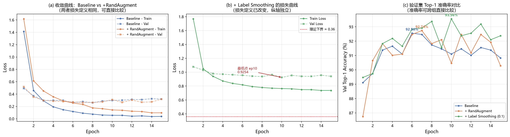
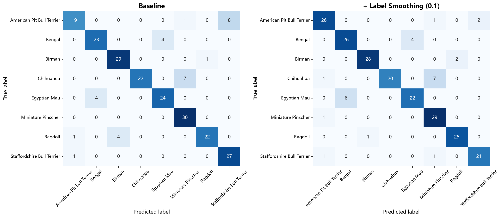
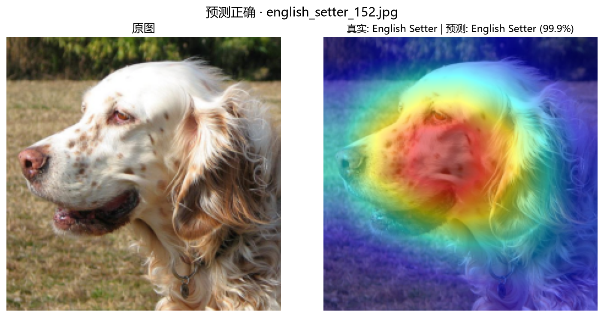
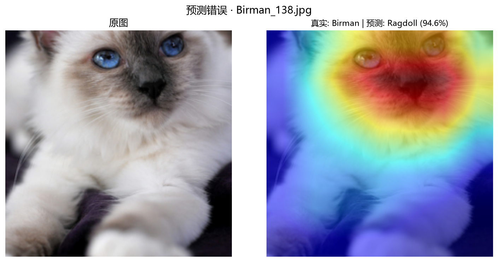

# 基于深度学习的牛津宠物细粒度分类实验报告

姓名：韩承翰 ｜ 学号：W124301159 ｜ GitHub：https://github.com/hch1256/oxford-pet-fine-grained

---

## 1. 任务背景与实验设置

**数据集**：Oxford-IIIT Pet，37 类（25 犬 + 12 猫）、共 7,349 张。属**细粒度分类**——类间差异仅在耳型、毛色分布、面部斑纹等局部区域，而同种动物姿态与背景差异极大，难度显著高于普通分类任务。

**数据划分**：合并官方 `trainval`(3,680) 与 `test`(3,669)，经两步分层抽样按 70:15:15 划分为 5,144 / 1,102 / 1,103 张，`random_state=42` 保证可复现。每类样本量在 184~200 之间，分层抽样确保三组消融实验的对比基准一致。**测试集全程不参与训练与模型选择**（模型选择仅依据验证集）。

**防数据泄漏**：训练集 Transform 含 `RandomResizedCrop` / `RandomHorizontalFlip` / `Normalize`；验证集与测试集**仅含** `Resize + CenterCrop + Normalize`，不含任何随机成分。

| 项目 | 配置 |
| :--- | :--- |
| 硬件 | NVIDIA RTX 4060 Laptop (8GB)，PyTorch 2.14.0 + CUDA 12.6 |
| 骨干网络 | ResNet-18（ImageNet 预训练），替换 `fc` 为 `Linear(512, 37)` |
| 优化器 | AdamW，lr = 1e-4，weight_decay = 1e-4，**无调度器（全程恒定）** |
| 批大小 / 轮数 | 32 / 15 epochs，混合精度训练（AMP） |

> 模型输出**裸 logits，不加 Softmax**——`nn.CrossEntropyLoss` 内部已含 `log_softmax`，额外加 Softmax 会导致梯度消失。

---

## 2. 实验结果与消融分析

所有指标均在**测试集（1,103 张）**测得。消融遵循**单变量控制**：每组仅改一个参数，其余全部保持默认。

| 实验配置 | Top-1 Acc (%) | Top-5 Acc (%) | Macro-F1 | 训练轮数/耗时 |
| :--- | :--- | :--- | :--- | :--- |
| 1. Baseline（ResNet-18 基础增强） | 90.84 | **99.27** | 0.9080 | 15 ep / 15.5 min |
| 2. 改进组 A（+ RandAugment） | 90.93 | 99.18 | 0.9084 | 15 ep / 17.1 min |
| 3. 改进组 B（+ Label Smoothing 0.1） | **92.38** | 98.91 | **0.9230** | 15 ep / 17.8 min |

> 改进组 A 选 RandAugment 而非模板示例的 MixUp：细粒度任务更依赖局部特征判别，RandAugment 通过随机组合 2 个算子并统一控制强度来扰动，比 MixUp 的样本线性插值更贴合这一需求。耗时波动（单轮 46~94 s）源于笔记本 GPU 的其他负载与温度降频，非算法差异。

**（a）Baseline 明显过拟合**：训练损失单调降至 0.038，验证损失第 8 轮触底（0.261）后持续反弹至 0.319（**+0.058**），终轮 train/val 差距达 0.281——后 7 轮已从学习泛化特征转为记忆训练样本。

**（b）Label Smoothing 显著抑制过拟合**：其损失**绝对值不可与 (a) 比较**——软标签使理论下界升至 `0.1 × ln(37) ≈ 0.36`（图中红线），量纲已改变。可比的是反弹幅度：验证损失第 10 轮触底（0.925）后仅反弹 **+0.016，为 Baseline 的 1/4**，终轮 train/val 差距收窄至 0.203。

**（c）准确率**：Label Smoothing 曲线整体上移，峰值 93.56%（验证集）；RandAugment 与 Baseline 几乎重合。

**结论：**

1. **RandAugment 收益有限**：Top-1 仅 +0.09pp（约 1 个样本），不具统计显著性。但正则化作用真实存在——训练损失终值由 0.038 升至 0.097（**2.5 倍**），泛化差距由 0.281 缩小至 0.221（**−21.5%**），说明模型记忆训练集的能力被有效抑制，只是未能转化为测试精度。
2. **Label Smoothing 效果显著**：Top-1 **+1.54pp**、Macro-F1 **+0.015**，且参数量与训练轮数完全相同。代价是 Top-5 略降（99.27% → 98.91%）——软标签压制了模型对正确答案的极端自信，属该方法的固有取舍，在只关注 Top-1 的场景下划算。

---

## 3. 错误案例分析（Bad Case）与 Grad-CAM 可视化

### 3.1 混淆矩阵局部图

从 37×37 混淆矩阵中裁出**最易混淆的 8 个品种**（覆盖 Baseline 中错分最重的 4 个类别对），左右对比 Baseline 与 Label Smoothing：

各类别对错分次数变化（格式 `A→B | B→A`）：

| 类别对 | Baseline | + RandAugment | + Label Smoothing |
| :--- | :--- | :--- | :--- |
| American Pit Bull Terrier ↔ Staffordshire Bull Terrier | 8 \| 1（9） | 5 \| 2（7） | **2 \| 1（3）** |
| Bengal ↔ Egyptian Mau | 4 \| 4（8） | 3 \| 2（5） | **4 \| 6（10）** |
| Chihuahua ↔ Miniature Pinscher | 7 \| 0（7） | 6 \| 1（7） | 7 \| 0（7） |
| Birman ↔ Ragdoll | 1 \| 4（5） | 2 \| 1（3） | 2 \| 1（3） |

**三条关键发现：**

1. **错误集中于生物学近缘品种**。美国比特犬与斯塔福郡斗牛㹴同属斗牛㹴类，孟加拉猫与埃及猫同属短毛斑点猫，缅甸猫与布偶猫都是蓝眼重点色长毛猫——模型犯错的正是**人类也需专业训练才能区分的类别**，符合细粒度分类的典型失败模式。

2. **Label Smoothing 的收益具有选择性**。它对比特犬↔斯塔福改善显著（9 → 3，**−67%**），但对**吉娃娃→迷你杜宾完全无效**（7 → 7），甚至使**孟加拉猫↔埃及猫恶化**（8 → 10）。推测软化标签放宽了决策边界，有利于「边界模糊」的类别对，对视觉特征直接重合的类别则无能为力。**这条负面结果划出了该方法的能力边界，是本实验最有价值的发现之一。**

3. **吉娃娃→迷你杜宾的错误是完全单向的**。Baseline 与 Label Smoothing 均为 `7 | 0`——反方向零错误，且迷你杜宾一行 30 个样本全部正确（30/30）。这不是对称的「混淆」，而是**系统性的单向偏置**：判别边界把一部分吉娃娃划入了迷你杜宾区域。仅提高正则化强度无法修正，需类别重加权或针对性难例挖掘。

### 3.2 Grad-CAM 热力图

Grad-CAM 对 `layer4[-1]` 特征图按目标类别梯度加权求和，定位模型决策时真正关注的区域。以下取自最终模型（+ Label Smoothing）。

**（1）预测正确**

真实 English Setter，预测 English Setter，置信度 **99.9%**。热力图集中在**犬只面部**（眼、口鼻、耳根），背景草地与身体毛发几乎无响应。说明模型**未依赖**「草地上、白色长毛」这类上下文捷径，而是聚焦于区分品种所需的头部形态特征——模型学到正确特征。

**（2）预测错误**

真实 Birman（缅甸猫），预测 Ragdoll（布偶猫），置信度 **94.6%**。热力图同样密集覆盖**猫的面部**（双眼、鼻梁、口鼻）。

本案例的价值在于：**模型关注的区域本身是正确的**。缅甸猫与布偶猫的区分依据恰是面部与肢端的毛色分布、眼睛颜色深浅——模型正是在这些区域下判断，只是两者视觉差异过于细微，特征强度不足以区分。因此这**不是「注意力跑偏」型错误，而是「特征判别力不足」型错误**，对应改进方向为提高输入分辨率或在 `layer4` 后引入注意力模块，而非修正注意力区域。

---

## 4. AI 辅助编程声明与 Bug 复盘

**使用环节**：本项目使用 AI 编程工具辅助生成 Grad-CAM 可视化代码与训练循环初稿、编写 TensorBoard 记录逻辑、以及代码模块化结构建议。所有 AI 生成代码均经本人实际运行验证，下列 Bug 为运行报错后定位修复。

**Bug 复盘：数据加载导致内存爆炸**

AI 最初生成的数据集代码用 `list(train_dataset) + list(test_dataset)` 合并两个 split，逻辑上等价于把**全部 7,349 张图像解码进内存**（约 4~5 GB）。配合 `num_workers=4` 时问题急剧放大——DataLoader 会把数据集对象 **pickle 复制给每个子进程**，4 个 worker 即 4 份完整副本，总内存需求超过 20 GB，进程被操作系统杀死。

**排查过程**：报错仅为「进程意外终止」，未指向内存。查阅 torchvision 安装目录下 `OxfordIIITPet` 源码后确认，其内部只保存 `self._images`（`pathlib.Path` 列表）与 `self._labels`，图像读取发生在 `__getitem__` 中——官方实现本身即是**延迟加载**，是我的合并方式破坏了这个特性。

**修复**：重写 `PetDataset`，只存 `(图片路径, 标签)` 元组，在 `__getitem__` 中才执行 `Image.open(path).convert("RGB")`。内存占用降至可忽略，`num_workers=4` 正常工作。经验具有普遍性：**只要 DataLoader 使用多进程，数据集对象就必须只存轻量引用，绝不能存解码后的图像。**
